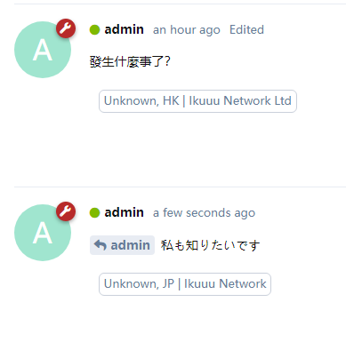

# User IP

> Display the IP address of the posting below the post

## ScreenShot



## Install

```sh
composer require gbcl/userip:"*"
php flarum migrate
```

## Update

```sh
composer update gbcl/userip:"*"
php flarum cache:clear
php flarum migrate
```

## Remove

```sh
composer remove gbcl/userip
php flarum cache:clear
```

## How to use

You just need to open the plugin in the background. :)

## Feature

- Support for websites using CDN
- Concise, detailed, understandable style
- No bugs (maybe?)

## Note

IP domain API is provided by [ip.sb](https://ip.sb)

Support my work at [afdian 爱发电](https://afd.gbclstudio.cn)
